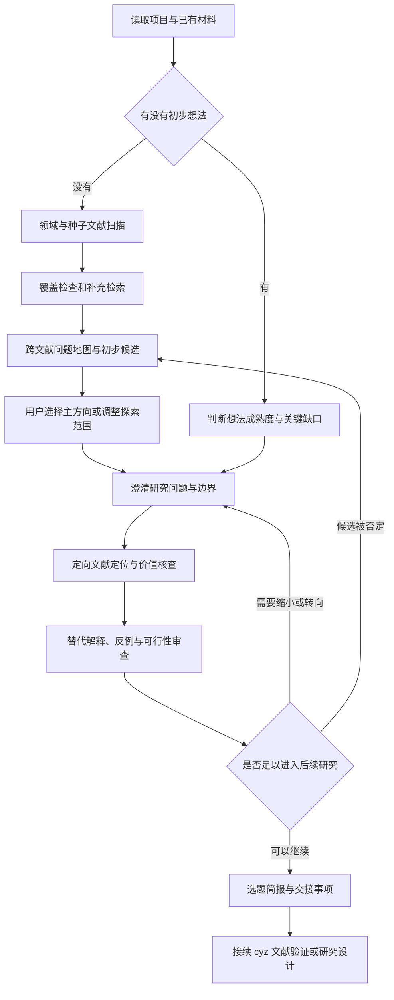

# CYZ 教育教学 Idea 发现与打磨：改造方案 v0.1

日期：2026-09-18。总体设计已经用户确认；本文将其落实为模块边界、记录方式及验收场景，供实现前审阅。当前尚未修改已安装 cyz。

## 1. 目标与已确认选择

为科研经验较少的使用者提供高度辅助的选题发现与打磨，优先服务学科教学实践与教学研究论文，需要时进入定量、定性或混合研究。

- 无想法：默认从“学科＋学段”出发，以文献为主要灵感来源；支持同时提供一批自行收集的文献。
- 有想法：按成熟度进入澄清、定位或审查，不强制重新进行广泛扫描。用户主动要求打磨时，已有较完整方案也可进入。
- 候选兼顾无需新增课堂数据和需要新增课堂数据的研究，明确标注资料需求，不承诺任何类型必然更容易发表。
- 分轮收敛：扫描、关键核查后先展示约 3–5 个候选，再深入用户感兴趣的方向。不为凑数制造候选。
- 默认先考虑研究价值与可行性，之后再匹配投稿方向。
- 工具负责阅读、比较、解释和推荐；用户主要判断兴趣、实际资源与关键研究取舍。
- 本次只改造 skill 工作流，不启动此前讨论的前端工作台。

## 2. 与 clarify-research-idea 的关系

参考项目：https://github.com/cpt13-g/clarify-research-idea

已检查版本：1f8334d144b39f9fb029293d26e1dc16196212d2。

借鉴成熟度分流、动态草图、高信息量单问题追问、文献定位、主动质疑、主张与证据对应、阶段性交接等机制。以独立表述编写教育适配模块，记录设计来源，不整包复制原文。原版继续独立安装，不修改其内容，也不作为 cyz 教育流程的强制运行依赖。

不照搬数学化输入输出、算法基线、消融实验、固定贡献数量或统一因果假设。探索、描述、解释、教学设计与效果研究采用与问题匹配的判断标准。已有 cyz 的资料缓存、证据标记和状态记录为权威约定，避免两套状态系统并存。

## 3. 两条入口，一套打磨过程

这是逻辑路径，不要求每次完整重走。已有核验材料可直接复用；阶段内可循环，不强行冻结尚无证据的结论。

### 无想法：发现路径

1. 读取领域、学段和已有文献，只追问确实影响检索的缺失边界。
2. 盘点文献、去重、标明全文访问程度，形成主题与研究对象覆盖概况。
3. 通过综述及代表研究了解领域；补查种子文献未覆盖的方向、相反结果和最接近研究，记录真实检索来源与范围。
4. 跨文献整理共识、分歧、条件差异和证据不足；不把“未找到”当作研究空白。
5. 深入核查少量代表性、矛盾性或决定候选成立与否的论文，避免全部 PDF 一律转换精读。
6. 展示约 3–5 个候选，推荐一个主选项，并解释取舍。后台保留其他方向与淘汰理由。
7. 用户选定后停止无边界扩展，进入定向核查与打磨。用户都不满意时，区分兴趣不符、材料门槛过高和证据不足，再调整搜索。

### 有想法：打磨入口

| 成熟度 | 优先动作 |
| --- | --- |
| 只有关键词或大方向 | 提出少量实质不同的研究切入点，明确具体教学内容和问题 |
| 有题目，问题不清楚 | 区分题目、研究目的与可回答的问题，缩小范围 |
| 有教学方案或偏好的方法 | 追问其要解决的具体问题和选择依据，不默认该方法有效 |
| 有研究问题，定位不足 | 定向查找最接近研究及其证据边界 |
| 方案较完整 | 检查替代解释、材料条件、主张与证据是否匹配 |

不把用户要求“润色题目”自动扩展成整轮打磨；若发现影响研究成立的缺口，应简要指出并给出下一步。

## 4. 教育教学打磨的共同步骤

1. **明确问题**：学段、学科内容、研究对象、具体情境、核心问题、暂不研究的范围。
2. **建立文献定位**：按角色选择关键文献，包括问题来源、最接近研究、解释或理论依据、证据方法与反面发现。以角色覆盖为准，不固定篇数，也不声称少量论文代表完整综述。
3. **说明可能价值**：增加哪种认识、解释、设计依据或适用边界。仅更换地区、年级或教学内容，不自动构成贡献。
4. **提出质疑**：已有研究是否已回答？是否有更简单解释？效果是否可能来自额外时间或教师差异？哪些案例或证据会使观点需要修改？
5. **检查证据条件**：区分已有、可取得和需新增收集的材料；估计实际负担。材料未经核实不得写为已具备。
6. **收敛与交接**：保留一个清晰主问题、必要子问题、暂定主张、证据路径与剩余风险，交给后续流程。

定性探索不强制提出可量化假设；教材或文本研究不强制开展课堂实验；教学设计稿应区分设计依据与实际效果证据。不能用满意度直接替代学习成效，不能把局部案例直接推广到所有学生。

## 5. 高度辅助的交互约定

每轮先说明当前瓶颈，展示工具已完成的比较或核查，再问一个影响研究选择的问题。用户不熟悉术语时，用当前候选举例解释；不要求用户先掌握理论框架或方法分类。

只有存在真实取舍时才给选项。明确推荐及理由，允许其他回答。“不知道”触发具体示例、材料检查或补充检索，不等于授权工具替用户确定重大研究决策。

每次实质变化更新选题卡；展示精简摘要，完整依据留在文件。已有确认不重复询问；当新证据改变原先前提时说明原因，再请求相关决定。用户说“继续”即可接续未完成事项。

三个关键确认点：主方向/问题范围、文献核查后的研究定位、进入后续阶段的选题简报。同一轮已经获得的明确确认可复用，不机械重复三个确认问题。

## 6. 记录与阶段衔接

保留 S0–S8 编号。S0 负责方向发现；S1 加强为问题明确与 idea 打磨。S1 可调用 S2–S4 的必要检索与阅读，但少量锚点核查不代表完整检索、综述或缺口验证阶段已通过。S5 仍负责详细研究设计。

新增 idea 状态字段，取值为：未开始、探索中、打磨中、待核验、可进入后续阶段、受阻。它独立于全流程阶段门检；“可进入后续阶段”不表示研究结论已证实或论文已经可发表。

当前选题主记录继续使用 `01-研究起点与问题.md`，扩展为：

- 原始想法或材料及来源；
- 入口、成熟度和探索边界；
- 问题地图与候选比较；
- 当前选题卡；
- 相近研究与反证审查；
- 材料条件和可行性；
- 已确认问题、选题简报和交接事项；
- 决策、淘汰理由及修改历史。

复用 `02-文献` 的检索、筛选、阅读与缓存记录，引用文献 ID，避免复制全文；详细证据继续进入 `03-文献证据矩阵.md` 和 `04-综述与研究缺口.md`。`00-项目状态.md` 仅记录当前状态、关键未知、下一步及成果链接。

信息来源标签沿用现有 cyz 标准，并明确用户原始陈述与外部核验的区别。用户报告的课堂现象保留来源，不能自动升级为独立核验事实。候选价值、可能原因和预期贡献标为研究者推断或 AI 建议。

网络不可用、文献仅有摘要时仍可生成暂定候选，但明确核验范围。足以动摇选题成立的未知必须查清或缩小主张后，才能标为可进入后续阶段。后续研究需要验证的假设可以保留为假设。

## 7. 文件改造清单

| 文件 | 变更 |
| --- | --- |
| `SKILL.md` | 强调发现与打磨双入口；加入成熟度分流及新模块路由 |
| `references/idea-scout.md` | 强化种子文献、覆盖偏差、问题地图、分轮候选与淘汰机制 |
| 新增 `references/idea-refinement.md` | 集中定义教育教学打磨过程、专门追问策略及退出条件 |
| `references/guided-mentor.md` | 加入初学者支持与“不知道”处理，具体打磨策略引用新模块 |
| `references/literature-workflow.md` | 区分探索扫描、选题关键核查和正式综述，复用阅读成果 |
| `references/project-protocol.md` | 加入 idea 状态、续接与失效决策处理 |
| `references/integrity-gates.md` | 检查选题交接条件与证据范围，不把格式完整等同成熟 |
| 新增 `templates/idea-workspace.md` | 提供研究起点、候选、动态选题卡与交接简报的统一模板 |
| `templates/project-status.md` | 加入 idea 状态和当前关键未知 |
| `scripts/init_project.py` | 新项目使用选题模板；已有文件继续不覆盖 |
| `使用说明.md`、`THIRD_PARTY_NOTICES.md` | 补充两条入口案例、教育适配边界和设计参考来源 |

旧项目按需补充缺少的小节，不覆盖已有研究问题和历史记录。不要求为打开旧项目强制重做选题。两处已安装的 cyz 同步更新，修改前备份；PDF 转换和语言打磨依赖保持现有职责。

## 8. 验收场景

1. 只有“高中物理教学”：文献优先探索，不强迫先讲课堂困惑。
2. 模糊领域加一批论文：先盘点并复用，再补查覆盖偏差，不重复询问文献中已有信息。
3. 只有“AI 辅助实验教学”：进入澄清与定向定位，不重扫整个学科。
4. 已有完整方案且要求打磨：审查关键缺口与替代解释，不直接跳去写论文。
5. 初学者回答“不知道”：提供解释和有依据的推荐，仍保留其关键选择权。
6. 候选混合两类材料路径：明确新增课堂数据需求，未核实资源不能写成已有。
7. 候选与既有论文高度相似：缩小、改变或淘汰，并记录理由，不能改个标题继续推荐。
8. 只有摘要或无法联网：标注暂定和访问范围，不捏造全文证据或宣称研究空白。
9. 定性、教材或教学设计研究：采用适合其问题的证据要求，不强制算法式假设、消融或效果实验。
10. 暂停后继续：恢复当前选题卡、决策与待核验事项，不重新转换有效缓存。
11. 新证据否定原选择：回退相关决定，保留历史，标明受影响的后续成果。
12. 简报完成：能明确接入下一步；S2–S5 未完成部分仍按实际状态记录。
13. 旧项目升级：已有原件、选题、决策和状态内容保留，新项目能创建完整模板。
14. 两份技能安装目录保持一致，内部引用有效，既有 PDF 与语言流程不受影响。

验收分为文件/初始化检查与交互场景演练。静态检查通过不等于真实选题质量通过；交互演练需标明使用模拟材料，还应使用用户后续真实文献进行试用。

## 9. 实施顺序

先备份并建立入口与记录模板；再改造发现与打磨模块；随后接入状态、文献与阶段门检；最后执行上述验收、同步两处安装并交付使用示例。前端可视化工作台仍保持延后。

本工作目录不是 Git 仓库，本方案以本地文件保存，未创建仓库或执行提交。
