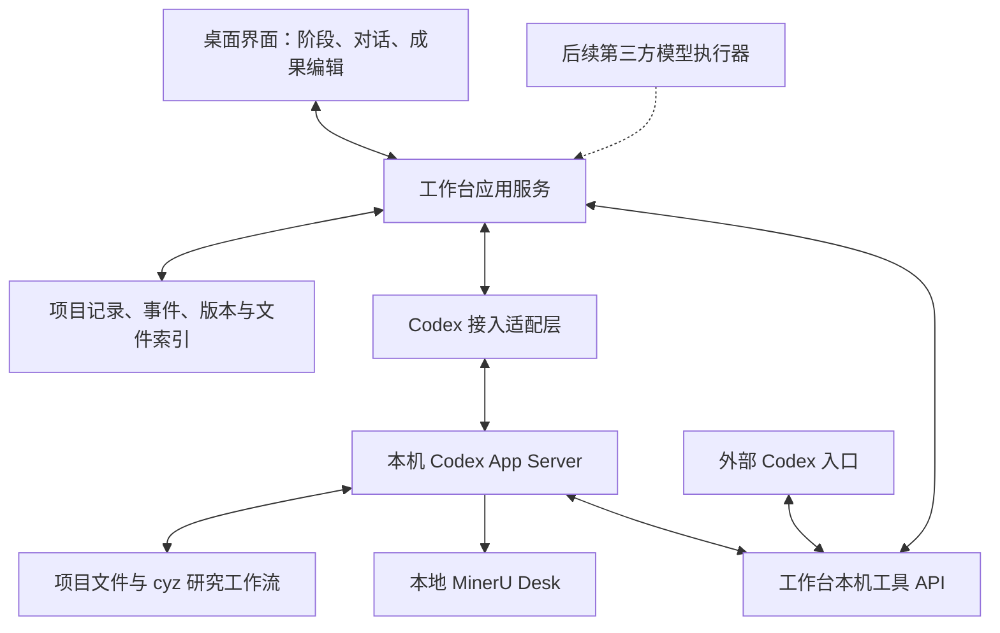

# CYZ 研究工作台：PRD 与技术方案

版本：v0.1，讨论结论稿  
日期：2026-09-18  
产品暂名：CYZ 研究工作台  
状态：需求与技术设计留档；尚未进入工作台开发  
启动条件：用户先继续完善 cyz-edu-research 工作流，之后明确指示启动工作台开发。

## 1. 项目背景与目标

用户已有 cyz-edu-research 教育研究工作流，可在 Codex 内完成领域扫描、研究问题聚焦、文献检索与精读、证据综合、研究设计、数据分析、论文写作及审查。工作流以项目文件和 Markdown 记录保存进度，并已接入本地 MinerU Desk，以及中文 humanizer-zh、英文 humanizer 语言处理。

当前困难是：研究过程分散在对话和文件中，难以一眼看清当前阶段、已完成成果、尚缺证据和需要研究者决定的问题。用户希望通过一个本地桌面界面组织研究，同时保留 Codex 的实际执行能力。

第一版的目标是让用户在工作台内选择项目、导入论文、发出指令、查看真实进度、回答关键问题、核查并编辑成果，减少与 Codex 桌面应用之间的切换。

第一版使用本机 Codex 执行研究任务。独立调用第三方模型 API 的能力推迟到后续版本，仅预留执行接口、缓存与用量设计。

## 2. 已确认决策

| 编号 | 决策 | 含义 |
| --- | --- | --- |
| D01 | Windows 本地桌面应用 | 直接选择文件夹建立或打开项目 |
| D02 | 以项目文件夹组织资源 | 研究材料、转换结果、草稿、分析、成果和工作台记录保存在项目内 |
| D03 | 外部材料默认复制 | 保留外部原件，后续使用项目内副本；记录来源及内容指纹 |
| D04 | 阶段内自动执行 | 机械操作自动处理，关键研究决定请用户确认 |
| D05 | 同项目只有一个执行方 | 支持保存状态后交接，避免两个执行入口同时改写项目 |
| D06 | 三栏布局 | 左侧研究阶段，中间进度与成果，右侧对话 |
| D07 | 前端可直接驱动 Codex | 前端发送指令、接收执行事件、展示确认并接收用户回答 |
| D08 | 连接本机 Codex 能力 | 工作台管理自己的研究会话，不要求遥控 Codex 桌面里已有的同一个任务 |
| D09 | S0–S8 全部可见 | 第一版仅重点做通文献导入、解析精读、证据矩阵和综述草稿 |
| D10 | 成果可预览和编辑 | 保存版本，人工未处理的修改不能被 AI 静默覆盖 |
| D11 | 研究进度优先 | 展示任务数、状态和待处理事项，工具细节及日志按需展开 |
| D12 | 手动恢复 | 中断后展示恢复点，用户点击继续；打开项目不自动产生模型调用 |
| D13 | 允许跨阶段工作 | 允许试写；缺失条件必须标明，不自动认定阶段完成 |
| D14 | 项目内文献优先 | 有必要时补充联网检索，避免无边界扩展范围 |
| D15 | 第三方 API 延后 | 未来支持自定义 OpenAI 兼容与 Anthropic 接口，不绑定中转平台 |
| D16 | 单项目主模型 | 后续独立模式每项目选一个主模型，可手动切换；不做首期多模型调度 |
| D17 | 缓存是基础能力 | 文件解析、研究成果和模型提示词缓存分别处理 |
| D18 | 不设费用自动停机 | 展示用量与可获得的估算费用；不因预算阈值暂停。重复失败和无进展循环仍应停止 |

“任务执行完毕”与“研究质量检查通过”分开显示，为本方案采用的核心状态设计。例如文献卡全部生成时任务完成，但引用尚未核验时阶段仍待核验。

## 3. 用户与使用场景

首期服务单个研究者在自己的 Windows 电脑上完成教育研究。协作权限、云同步、多用户服务不是首期目标。

典型场景：

1. 用户选择一个文件夹建立论文项目。
2. 导入若干 PDF，应用复制材料并登记来源。
3. 用户在右侧输入“精读这些论文，整理与当前研究问题有关的证据”。
4. Codex 读取工作流规则，通过本地 MinerU 解析需要处理的文献，生成文献卡与证据记录。
5. 中间区域逐篇显示待处理、处理中、已完成、失败或待核验。
6. 用户打开文献卡、原 PDF 或对应页码，核查重要结论并修订。
7. Codex 综合证据，提出研究缺口候选；用户在前端确认方向。
8. 根据已核验材料生成综述草稿，用户直接编辑并保存版本。
9. 中断后重新打开项目，先查看已完成内容和恢复位置，再点击继续。

## 4. 第一版范围

### 4.1 必须完成

- 建立、打开和切换本地项目，检查所需目录及项目状态。
- 导入 PDF 等研究材料，默认复制进项目，保留来源和内容指纹。
- 展示全部研究阶段及每阶段的状态、成果、缺失条件和下一步。
- 对话框连接本机 Codex，支持发起任务、继续对话、停止当前执行和回答待确认事项。
- 显示 Codex 可公开输出的执行消息和工具事件；不展示或伪造模型内部思维过程。
- 跑通“文献导入 → MinerU 解析 → 精读卡 → 证据矩阵 → 综述草稿”。
- 预览和编辑 Markdown；以表格视图展示证据矩阵；提供原 PDF 和图片查看入口。
- 保存成果版本，处理人工编辑与 AI 修改冲突。
- 支持有效缓存复用、失败文件单独处理、中断后手动继续。
- 提供本机工作台 API，使外部 Codex 能登记或接管任务、报告进度、提交成果。
- 展示实际可获得的 token、额度和缓存信息；缺失信息显示未知。

### 4.2 仅提供记录与展示的阶段

S0 灵感发现、S1 研究问题、S5 研究设计、S6 数据分析、S8 全文审查在界面中有位置，可保存材料、决定及阶段状态。第一版不承诺为这些阶段提供完整的一键自动执行界面。

这不禁止 Codex 按现有工作流执行用户明确提出的任务；只是这些阶段不属于首期完整产品验收范围。

### 4.3 不在第一版实现

- 自建第三方模型 agent 执行循环及相关付费调用。
- 每一步分配不同模型、多智能体并行执行。
- 在线多人协作、跨电脑实时同步、云端项目托管。
- 遥控或复刻 Codex 桌面应用现有任务的全部状态。
- 通用 IDE、任意程序安装器、项目外通用电脑自动化界面。
- 完整 Word 排版编辑器、全功能参考文献管理器。
- 任意论文都正确解析、自动证明研究结论、保证去除所有 AI 风格等承诺。

## 5. 用户故事

1. 作为研究者，我希望选择本地文件夹建立项目，以便按论文归类资源。
2. 作为研究者，我希望打开已有 cyz 项目，以便继续原来的工作。
3. 作为研究者，我希望导入材料时保留外部原件，以便避免误改。
4. 作为研究者，我希望重复导入相同文件时收到复用提示，以便避免重复解析。
5. 作为研究者，我希望看到全部研究阶段，以便理解当前任务与论文全局的关系。
6. 作为研究者，我希望从任意合适阶段开始，以便使用已有研究成果。
7. 作为研究者，我希望直接在前端向 Codex 发指令，以便减少切换应用。
8. 作为研究者，我希望关键研究问题以明确选项和推荐理由呈现，以便有依据地决定。
9. 作为研究者，我希望看到正在处理哪篇文献，以便判断任务是否正常推进。
10. 作为研究者，我希望失败原因与失败文件关联，以便只处理需要修复的部分。
11. 作为研究者，我希望查看文献卡对应的原文位置，以便检查证据。
12. 作为研究者，我希望在证据矩阵中比较多篇研究，以便形成综述。
13. 作为研究者，我希望看到待核验标记，以便区分可靠证据和初步判断。
14. 作为研究者，我希望直接修改草稿并保存历史，以便掌握最终表达。
15. 作为研究者，我希望 AI 修改与人工修改发生冲突时可以比较，以便避免丢失内容。
16. 作为研究者，我希望未完成阶段也能试写，以便探索思路。
17. 作为研究者，我希望材料更新后看到受影响成果，以便安排复核。
18. 作为研究者，我希望手动停止任务后保留已完成成果，以便稍后继续。
19. 作为研究者，我希望重新打开项目时先确认恢复位置，以便控制后续执行。
20. 作为研究者，我希望从外部 Codex 操作同一项目时前端同步状态，以便灵活选择入口。
21. 作为研究者，我希望同一项目不会被两个执行方同时修改，以便避免重复任务与冲突。
22. 作为研究者，我希望看到真实用量和缓存命中信息，以便了解资源消耗。
23. 作为研究者，我希望项目能够整体备份，以便保留材料、成果及研究决定。
24. 作为研究者，我希望以后接入第三方模型时仍使用同一个项目结构，以便保留既有工作。

## 6. 界面与交互

### 6.1 主界面

| 区域 | 内容 |
| --- | --- |
| 顶部 | 项目名称与位置、Codex 连接状态、当前执行方、停止入口、可获得的用量信息 |
| 左侧 | S0–S8 阶段、阶段状态、待确认数量；材料与成果入口 |
| 中间 | 当前阶段摘要、任务清单、实际进度、成果预览或编辑、证据核验与版本比较 |
| 右侧 | 对话记录、输入框、关联文件、关键问题卡片、审批卡片、执行记录折叠区 |

阶段切换不自动启动任务。选中文件可在对话中作为任务附件引用；实际发送给模型的内容由任务需求决定，不默认发送整个项目。

### 6.2 进度表达

优先使用可核验的数量和状态，例如：已解析 8/12 篇、已完成精读 5/12 篇、3 条证据待核验。

总量未知时显示“进行中”和最近活动，不生成虚构百分比或预计完成时间。文献卡生成完成只能证明任务产物存在，研究检查需另行完成。

### 6.3 确认与停止

研究决定卡片展示问题、现有依据、建议、选项与取舍。操作审批与研究决定分开：允许读取或执行命令不等于认可学术结论。

点击停止后显示“正在停止”，收到执行方终止事件后才显示“已停止”。停止不回滚已完成成果；正在写入的结果按完整性检查决定能否继续使用。

### 6.4 中断恢复

重启后核查 Codex 是否仍在执行，区分前端断连与任务终止。仍在执行时恢复订阅，不重复提交。任务已中断时展示最后完成步骤、剩余工作和不确定结果，用户点击继续后才发起新执行。

关闭窗口时若有任务进行中，提供“保持后台执行”或“停止后退出”的明确选择；默认行为待界面设计确认，不把关闭窗口等同于任务已取消。

## 7. 技术方案概览

### 7.1 已核实的接入基础

本机安装了 Codex CLI，检查时处于 ChatGPT 登录状态。CLI 提供 app-server 接入命令。官方文档提供任务创建与恢复、执行事件、用户输入和审批等接口。

上述检查证明存在可用接入路线，尚未证明自建前端已经完成端到端接入。当前 app-server 在本机帮助中标记为实验性，需要按安装版本验证协议。

第一版建议使用 Codex App Server 承担执行，不自行仿制 Codex 的模型循环、上下文管理或工具运行环境。

### 7.2 建议架构

Codex App Server 接口用于“前端驱动 Codex”；工作台 API 用于“Codex 操作研究项目”。两者职责不同，不互相替代。

### 7.3 建议技术栈，尚未锁定

| 层 | 建议 | 理由 |
| --- | --- | --- |
| 桌面壳 | Electron | 便于接本机进程、文件夹及 Windows 环境，与已有 Desk 经验一致 |
| 界面 | React + TypeScript | 适合阶段列表、事件流、表格和编辑器组合 |
| 应用服务 | TypeScript / Node.js | 集中处理项目、任务、事件、文件与 Codex 通信 |
| 项目结构化记录 | 项目内 SQLite | 支持事件、版本、任务和关联查询；研究正文继续使用 Markdown |
| Codex 连接 | 优先本地 stdio | 由应用隐藏启动受管进程；是否改用受支持的本机服务连接由原型验证决定 |
| 编辑与预览 | Markdown 编辑器、受限制的 HTML 预览、PDF 查看组件 | 支持阅读、编辑和原文核查，不扩展为全功能 Office 编辑器 |

此技术栈是建议，不是已实施或用户指定的最终选型。开发前先验证本机接入，再锁定依赖与版本。

## 8. 项目数据与可迁移性

### 8.1 资源归属

项目内保存：导入副本、转换成果和配图、文献卡、证据矩阵、方案、分析结果、草稿、正式输出、研究决定、工作台事件与版本记录。

应用统一管理：API 密钥、登录状态入口、程序路径、模型配置。MinerU 程序及大型模型文件不复制到每个项目。

继续兼容 cyz 的项目状态、文献缓存、证据矩阵和稿件等现有产物。具体文件结构以用户后续完善的工作流版本为准，前端适配器不提前固定旧模板。

### 8.2 权威来源

- 原始材料：项目内的导入副本，保留指纹与外部来源记录。
- 研究内容：Markdown 等可直接阅读的项目成果。
- 工作台执行事件、版本与关联：结构化记录。
- 阶段与决定：通过同一个项目服务写入结构化记录，并同步到 cyz 状态文档；外部修改触发重新读取与冲突检查，不能形成两套互相矛盾的进度。

数据库不能成为唯一可读的研究档案。项目应包含可读摘要和必要的记录导出；文件监听只负责发现变化，不能根据一个文件出现就认定研究检查通过。

### 8.3 Codex 会话边界

Codex 原生会话历史可能保存在 Codex 自己管理的位置。工作台在项目内保存会话标识、用户可见事件、阶段摘要、任务关联和成果，不擅自搬移 Codex 内部数据库。

因此需要区分：

1. 同机继续：原会话可恢复时继续使用。
2. 项目整体迁移：材料、成果和研究状态可迁移；原生会话未必可用。必要时经用户确认建立新会话，从项目摘要和证据继续，明确标记这是重新接续而非原会话完整恢复。

## 9. 与 cyz 工作流的衔接协议

工作台负责展示和执行协调，cyz 工作流负责研究规则、阶段产物和质量条件。前端不另写一套会与 Skill 分叉的学术规则。

建议在 cyz 后续完善时明确以下内容；字段形态可调整，但语义应稳定：

| 对象 | 所需信息 |
| --- | --- |
| 阶段 | 稳定编号、名称、进入条件、预期产物、完成检查、允许回退关系 |
| 任务 | 编号、阶段、目标、输入、状态、执行方、已完成数量、下一步 |
| 成果 | 编号、类型、项目内位置、版本、生成任务、关联输入、检查状态 |
| 证据 | 来源、PDF 页码/块定位、证据状态、支持的主张与限制 |
| 决定 | 需要用户回答的问题、选项、建议理由、答案、影响范围 |
| 事件 | 编号、项目与任务归属、事件类型、时间、顺序、可展示内容 |
| 恢复点 | 最后确认完成步骤、未完成项、运行中的外部任务 ID、恢复建议 |

必须区分：未开始、执行中、等待用户、失败、中断、执行完成，以及阶段检查的待核验/通过/需修改。

Codex 通过结构化接口报告这些事件。对普通执行日志的自然语言分析只作为辅助，不能成为判定阶段通过的唯一依据。

## 10. Codex 接入与工作台 API

### 10.1 Codex 接入适配层

适配层封装连接、协议初始化、能力与版本检查、会话创建/恢复、发送消息、停止执行、接收流式消息、用户输入及审批回复。

工作台保存项目与 Codex 会话关联；一个项目可累积多次任务记录，但同时仅有一个执行方持有执行权。是否长期复用单个会话或按阶段分会话，由上下文长度和恢复验证决定，不影响项目成果的连续性。

认证优先交给本机 Codex 管理，不复制登录 token 到项目或渲染进程。登录失效时显示登录入口或明确状态。已有 ChatGPT 登录能否被受管 app-server 直接复用，要在接入原型中验证。

### 10.2 工作台 API 能力

以下是设计契约，不代表已有可调用接口：

- 查询项目、阶段、任务、成果和待确认事项。
- 获取执行权、续期、释放执行权。
- 登记任务、更新状态、追加进度事件。
- 关联导入材料、解析缓存和源文献。
- 提交候选成果、查询或发布版本。
- 创建研究决定、读取用户回答。
- 保存恢复点、标记成果过期或需要复核。

接口统一包含项目 ID、任务 ID、请求 ID、执行方 ID 和适用的版本信息。重复请求应幂等；过期执行方不能继续提交修改；版本冲突返回明确冲突状态。

首期可通过本机 API 加配套 Skill 或薄工具桥供 Codex 使用。HTTP 或 MCP 的最终选择由接入验证决定，避免同时维护两套业务逻辑。

### 10.3 执行权与外部接入

采用项目级执行租约：标识当前执行方、关联任务、心跳及过期状态。交接时先确认旧执行是否停止或释放，再由新执行方取得执行权。

租约约束参与工作台协议的执行方，不能阻止所有外部编辑器或任意脚本直接改文件。对绕开接口的变更使用指纹、监听和版本检查发现冲突，不宣传为绝对文件隔离。

### 10.4 项目范围与权限

首期产品功能限定于论文研究。Codex 自身可能具备通用工具能力，因此限制必须结合项目工作目录、可用沙箱、工具配置和成果提交检查实现，不能仅依靠界面隐藏按钮。

允许读取已配置的共享 Skill、MinerU 程序和模型；研究成果写入项目目录。工作台 API 仅监听本机、进行认证和项目路径校验；密钥不交给预览内容。Markdown/HTML 预览禁用任意脚本和本地特权访问。

## 11. 成果编辑、版本与证据变化

用户编辑时记录基础版本。AI 修改以候选版本提交，发布前检查基础版本是否仍是当前版本。冲突时保留双方内容，展示比较并让用户选择，禁止静默覆盖。

原始导入材料按只读来源处理；转换缓存、阅读笔记与解释分开保存，重建缓存不能抹掉研究者判断。

为成果记录依赖：文献卡依赖 PDF/缓存；证据矩阵依赖文献卡；综述依赖矩阵、研究问题与引用记录。上游变化后标记相关下游成果“需复核”，不自动删除，也不自动整批重写。

跨阶段草稿保留缺失条件及证据状态。终稿仍需通过 cyz 的相应研究检查和语言语义回归。

## 12. 缓存、上下文与用量

### 12.1 第一版

- PDF 内容指纹及解析条件未变时复用缓存。
- 研究成果按输入版本、任务目标、规则版本和执行模型记录来源；仅条件匹配且结果有效时作为已完成任务复用。
- 保留原文与证据定位，摘要不能成为唯一证据来源。
- 由 Codex 管理其模型请求和上下文缓存；工作台不承诺控制 Codex 服务端缓存保留时间、命中率或折扣。
- 保持研究指令稳定，减少无必要的上下文变动，按需读取材料。
- 显示协议实际返回的用量。ChatGPT 登录模式下不将 token 简单换算为 API 扣费；无可靠价格时显示额度/用量或费用未知。
- 不设费用触发的自动暂停，但必须限制重复失败重试和无进展循环。

### 12.2 后续第三方执行器预案

预留共同执行接口：启动任务、发送消息、停止、恢复、回答问题、订阅事件、获取用量与能力。提供方实现不能直接改写项目结构，应复用同一项目服务和成果版本机制。

未来提供自定义地址、密钥、模型名称、接口类型和连接测试。项目选择一个主模型，切换后保留成果来源，不把旧结果当成新模型重新生成。

OpenAI 兼容与 Anthropic 分别适配，不假设存在统一“缓存协议”：

- OpenAI 兼容：按实际端点支持情况传递缓存相关参数，解析其缓存命中用量；不支持时明确标识。
- Anthropic：按支持情况处理 cache_control 及缓存写入/读取用量。
- 提示词组织：稳定规则与工具定义靠前，重复资料顺序稳定，动态问题靠后。
- 本地缓存与服务商提示词缓存分别展示，不将本地复用次数当作 API 命中。
- 请求参数、返回用量和估算单价需可追溯；服务商不返回命中信息时显示未知。
- 不承诺中转服务会透传参数或提供相同计费优惠，也不在首期选择具体中转平台。

## 13. 失败处理与恢复

| 情况 | 行为 |
| --- | --- |
| Codex 未安装或版本不兼容 | 展示诊断结果，阻止启动，给出安装/版本处理指引；不静默升级 |
| 登录失效或额度不可用 | 保留任务状态，显示恢复条件，不重复发起同一任务 |
| 前端断开 | 先重新连接并读取任务状态，不直接重复发送指令 |
| 模型请求结果不明 | 保留请求与任务关联，标记待核查，避免整批重跑 |
| MinerU 失败或缺模型 | 记录错误，按现有 Skill 规则降级；不自动转云端 |
| 一个文献任务失败 | 保留其他已完成文献，可单独重试失败项 |
| 原件或成果被外部修改 | 更新指纹，标记相关缓存/成果需检查，必要时展示冲突 |
| 用户停止 | 保存已完成产物与恢复点，等待执行方确认停止 |
| 过期确认回复 | 拒绝应用到新任务，提示该请求已失效 |
| 未知协议事件 | 保存可诊断记录；不能误报任务完成或自动批准 |

## 14. 验收标准

测试以用户可见行为与文件结果为准，不以组件内部实现为验收对象。现有 MinerU/缓存接入的两页合成 PDF 可作为回归样本，但必须另选用户授权的真实论文验证阅读体验。

| 编号 | 场景与通过条件 |
| --- | --- |
| AC01 | 新建项目：所需结构产生于所选文件夹，打开项目本身不触发模型调用 |
| AC02 | 导入材料：项目内存在完整副本，外部原件哈希不变；同名不同内容不会互相覆盖 |
| AC03 | 重复导入/解析：提示已有材料或有效缓存，不无故重复转换 |
| AC04 | 前端发指令：本机 Codex 在指定项目开始任务，消息和事件进入正确项目 |
| AC05 | 用户回答：研究决定或审批回复关联正确请求；超时旧回复不能作用于新任务 |
| AC06 | 文献流程：导入到综述草稿完整跑通，每项结果能追溯到任务和输入版本 |
| AC07 | 进度真实性：已完成数量与真实任务/成果一致；未知总量不显示虚假百分比 |
| AC08 | 质量状态：文献卡生成与证据核验分开；缺证据不会自动通过阶段检查 |
| AC09 | 预览编辑：Markdown、矩阵、图片和 PDF 可打开；人工修改保存并能追溯版本 |
| AC10 | 修改冲突：AI 基于旧版本提交时保留双方内容，不覆盖新人工稿 |
| AC11 | 跨阶段：允许提前试写，同时显示缺失条件；上游更新后相关稿件标记需复核 |
| AC12 | 中断重开：已完成结果保留；先判断是否仍在执行，需重启任务时由用户点击继续 |
| AC13 | 执行交接：参与协议的两个执行入口无法同时取得同项目执行权 |
| AC14 | API 重放与路径：重复请求不产生重复成果；项目路径越界被拒绝 |
| AC15 | 单篇失败：可单独恢复，不重做其他有效文献成果 |
| AC16 | 用量：展示真实返回数据；缺数据不编造命中率、费用或节省金额 |
| AC17 | 项目备份：材料、成果、决定和可读进度可恢复；原生会话不可恢复时明确告知 |
| AC18 | 后续适配边界：使用不发起模型调用的测试执行器，可验证相同项目与事件协议，不要求首期实现第三方 API |

## 15. 分阶段推进与当前暂停点

### 阶段零：先完善 cyz 工作流——当前优先事项

用户继续改进选题、文献、写作、审查等研究流程。工作台开发暂不开始。

建议同步沉淀阶段定义、任务状态、产物类型、证据标记、用户决定、成果依赖和恢复记录。现有 Markdown 项目保持可用，不要求先完成一套大型服务。

### 阶段一：用户明确启动后，做接入验证

验证本机 Codex 登录复用、会话启动/恢复、流式事件、用户输入、审批、停止及断连恢复。仅用小型测试项目，不改正式研究材料。

产出接入验证结论、支持的 Codex 版本范围及必要兼容策略。验证未通过时先修正技术方案，不直接铺开界面开发。

### 阶段二：界面草图与设计确认

围绕真实文献项目展示三栏界面、阶段状态、文献列表、证据矩阵、编辑冲突与恢复提示；用户确认后进入实现计划。

### 阶段三：实现第一版完整小流程

完成项目、对话、Codex 接入、MinerU、进度、成果编辑、版本与恢复，按验收表检查。

### 阶段四：真实研究验证与后续扩展

先根据真实论文使用修正，再考虑覆盖其余研究阶段。第三方 API 执行器后续单独设计、验证和验收，不阻塞首期。

本 PRD 不是开发启动指令，不创建定时任务，不安排后台持续开发。后续由用户明确通知开始。

## 16. 需要在开工前验证的技术事项

以下事项不会改变已确认产品范围，但必须在实现前验证：

- 本机 Codex App Server 的协议版本、运行方式和现有认证复用。
- 用户输入及审批请求的可用能力、恢复行为和中断语义。
- Codex 实际可报告的缓存 token、额度及其他用量字段。
- Windows 目录和进程权限下可落实的项目写入边界。
- 更新后的 cyz 状态格式、证据矩阵格式和旧项目兼容方式。
- 成果编辑器与现有 Markdown 格式的往返一致性。
- 窗口关闭时保持后台或停止的默认交互。
- 技术栈和第三方组件许可、版本及打包方式。

未知能力必须明确标识，不能用“已接入”或“已支持”代替验证。

## 17. 资料依据

- 本次对话中逐项确认的产品选择；后续以用户最新明确决定为准。
- 现有 cyz-edu-research、mineru、humanizer-zh 与 humanizer 工作流文件。
- 本机 Codex CLI 帮助与登录状态检查；仅证明检查时的安装和登录情况。
- [Codex App Server 官方文档](https://developers.openai.com/codex/app-server)：会话、任务事件、用户输入、审批与认证接口。
- [Anthropic 提示词缓存官方文档](https://platform.claude.com/docs/en/build-with-claude/prompt-caching)：cache_control、缓存时长及读取/写入用量机制。
- [DeepSeek 上下文缓存官方文档](https://api-docs.deepseek.com/guides/kv_cache/)：说明兼容服务的缓存行为可能具有服务商差异，不作为首期指定供应商。

文档中的接口能力与缓存支持应在实际开发时按安装版本和服务商文档重新核验。本文没有运行工作台原型，也没有承诺官方实验性接口长期保持不变。
